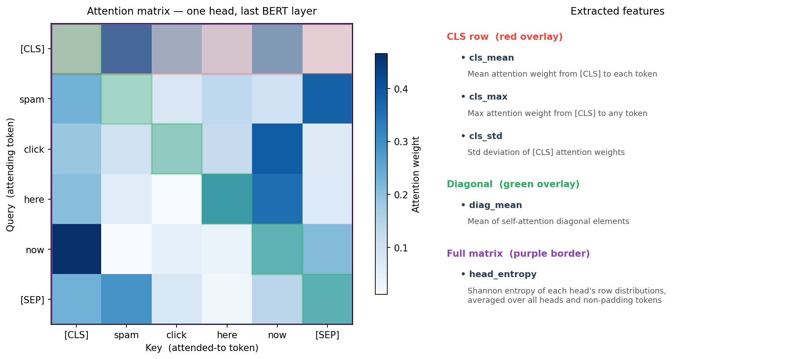
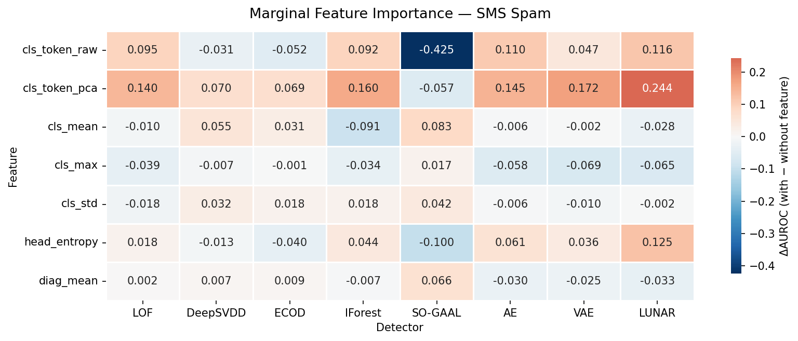
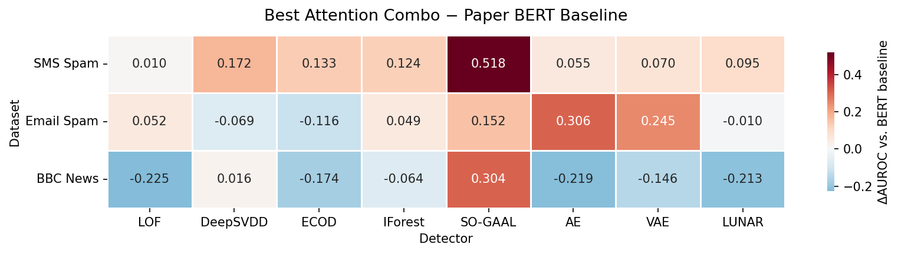

# Attention-Feature Ablation for Anomaly Detection

Research project investigating whether BERT attention patterns can match or exceed
full CLS-token embeddings for text anomaly detection, using a systematic ablation
over 31 feature combinations and 8 detectors across three datasets.

## Motivation

This project extends and evaluates against the benchmark established by
[NLP-ADBench](https://github.com/USC-FORTIS/NLP-ADBench) (Xu et al., 2023), which
provides standardised anomaly detection benchmarks on text data using BERT and
OpenAI embeddings as baselines. Rather than relying on the full CLS-token
embedding, we investigate whether BERT attention patterns alone — far cheaper to
store (12 heads × sequence-length scalars per layer) — can match or exceed those
baselines. All AUROC results reported in the figures are compared directly against
the NLP-ADBench paper's BERT-base and OpenAI embedding scores.

## Datasets

| Dataset | Task | Max length |
|---------|------|-----------|
| SMS Spam | spam vs. ham | 32 |
| Email Spam | spam vs. ham | 256 |
| BBC News | topic outliers | 512 |

Data and precomputed embeddings are fetched automatically from the
[NLP-ADBench](https://huggingface.co/datasets/kendx/NLP-ADBench) HuggingFace dataset.

## Features

Five attention blocks extracted from the last BERT layer, plus two CLS-token baselines:

| Feature | Description |
|---------|-------------|
| `cls_mean` | Mean attention weight from CLS token across positions |
| `cls_max` | Max attention weight from CLS token |
| `cls_std` | Std deviation of CLS attention weights |
| `head_entropy` | Shannon entropy of each attention head, averaged over tokens |
| `diag_mean` | Mean of the attention diagonal (self-attention) |
| `cls_token_pca` | PCA(64) of paper's precomputed BERT-base CLS embeddings |
| `cls_token_raw` | Raw 768-d CLS embeddings (paper baseline, no scaling) |

## Detectors

| Detector | Type | GPU-heavy |
|----------|------|-----------|
| LOF | Density | No |
| ECOD | CDF-based | No |
| IForest | Tree ensemble | No |
| DeepSVDD | Neural network | **Yes** |
| AE | Autoencoder | **Yes** |
| VAE | Variational AE | **Yes** |
| LUNAR | GNN-based | **Yes** |
| SO-GAAL | GAN | **Yes** |

GPU-heavy detectors are **skipped automatically** when no CUDA GPU is detected.

> **Recommended**: a CUDA-capable GPU. Without one, DeepSVDD, AE, VAE, LUNAR, and
> SO-GAAL are skipped and results will be incomplete. CPU-only runs are fine for
> LOF, ECOD, and IForest.

## Feature Extraction

The diagram below shows which part of the attention matrix each feature is computed
from, for one head of the last BERT layer.



## Results

### Feature Importance (SMS Spam)

Each cell shows the marginal AUROC gain from including that feature (averaged over
all combinations that do/don't contain it). Red = helpful, blue = harmful.



### Best Attention Combo vs. BERT Baseline

Each cell shows our best attention-only AUROC minus the paper's BERT embedding
baseline for that detector. Red = attention beats embeddings, blue = embeddings win.



## Key Findings

- **Attention alone can beat embeddings**: `head_entropy` with LUNAR exceeds the
  paper's BERT baseline on SMS Spam; SO-GAAL on attention-only reaches AUROC 0.85
  using 12–48 dimensions versus 768–3072 for full embeddings.
- **Detector–feature affinity**: density detectors (LOF, LUNAR) prefer
  `head_entropy`; tree detectors prefer `cls_token_pca`; adversarial detectors
  (SO-GAAL) benefit from `cls_mean` but are hurt by `cls_token`.
- **Sub-additive interaction**: `cls_token × head_entropy` is redundant in 12/24
  dataset × detector cells — they capture overlapping distributional signal.

## Installation

```bash
pip install -r requirements.txt
```

## Usage

### 1. Ablation study (SMS Spam)

```bash
python main.py
```

Outputs:
- `sms_spam_attn_ablation_all_detectors.csv` — per-(combo, detector) AUROC/AUPRC
- `sms_spam_attn_importance_all_detectors.csv` — marginal feature importance

The run is **resumable**: if interrupted, re-running picks up from the last
completed (combo, detector) pair.

### 2. Cross-dataset replication

Run after obtaining ablation CSVs for all three datasets:

```bash
python cross-dataset-analysis.py
```

Outputs: `cross_dataset_summary.csv`

### 3. Factorial design analysis

```bash
python factorial-model/factorial_study.py
```

Fits main-effects and two-way interaction regression models (HC3 robust errors,
BH FDR correction) across all dataset × detector cells.

### 4. Generate figures

```bash
python plot_results.py
```

Writes `figures/feature_importance.png` and `figures/gain_vs_bert.png`.

## Project Structure

```
main.py                      # Entry point
config.py                    # Dataset, model, and detector settings
features.py                  # BERT attention extraction and feature caching
detectors.py                 # Anomaly detector factory
ablation.py                  # Feature matrix builder, ablation loop, importance
plot_results.py              # Figure generation
cross-dataset-analysis.py    # Cross-dataset replication
factorial-model/
  factorial_study.py         # Factorial regression analysis
figures/                     # Generated plots (run plot_results.py)
sms-spam/                    # SMS Spam results
email_spam-out/              # Email Spam results
bbc-out/                     # BBC News results
comments.md                  # Extended findings and notes
```
